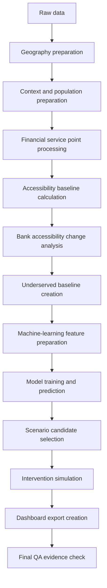

<div align="center">

# Rural Financial Access in Scotland

### A reproducible geospatial, machine-learning and scenario-simulation framework for assessing physical financial access across rural Scotland

[](#project-status)
[](#quality-assurance)
[](#spatial-unit)
[](#power-bi-dashboards)

[Overview](#project-overview) · [Evidence](#validated-evidence) · [Pipeline](#analytical-pipeline) · [Machine Learning](#machine-learning) · [Dashboards](#power-bi-dashboards) · [Run QA](#run-the-final-qa) · [Limitations](#interpretation-boundaries-and-limitations)

</div>

---

## Project overview

This project studies **physical financial access in rural Scotland**. It combines geospatial analysis, machine learning and scenario simulation to identify rural Data Zones that may have weak access to banks, ATMs and post offices.

The final analytical output is a four-page Power BI dashboard framework covering:

| Page | Analytical view |
| :--: | --- |
| **01** | Financial service distribution overview |
| **02** | Accessibility analysis |
| **03** | Underserved rural zone identification |
| **04** | Scenario simulation and policy insights |

The project was built for an **MSc Data Analytics dissertation at De Montfort University**.

### Main aim

> Build a reproducible geospatial and machine-learning framework that identifies underserved rural zones in Scotland and tests possible intervention options for improving access to physical and financial services.

### Research questions

| # | Research focus |
| :--: | --- |
| **RQ1** | How are physical financial access points distributed across Scotland? |
| **RQ2** | Which rural areas have weaker access to banks, ATMs, post offices or any access point? |
| **RQ3** | Can machine learning help identify underserved rural Data Zones? |
| **RQ4** | Which rural zones should be prioritised for simulated intervention? |

---

## Validated evidence

| Geography | Context | Modelling | Scenario | Dashboard export |
| ---: | ---: | ---: | ---: | ---: |
| **7,392** Data Zones | **96,096** panel rows | **1,226** rural predictions | **409** intervention candidates | **1,636** before/after rows |

### Key validated outputs

| Output area | Validated row count |
| --- | ---: |
| Master Data Zone geography | **7,392** |
| Context panel | **96,096** |
| Accessibility baseline | **7,392** |
| Rural ML prediction outputs | **1,226** |
| Scenario intervention candidates | **409** |
| Scenario simulation outputs | **409** |
| Dashboard 4 before-and-after long table | **1,636** |

---

## Financial access scope

The analysis combines three types of physical financial service point:

| Service | Role in the framework |
| :--: | --- |
| **Bank** | Represents access to physical bank branches. |
| **ATM** | Represents physical access to cash withdrawal. |
| **Post office** | Represents an additional channel that may support basic access to cash and financial services. |

> [!NOTE]
> Rural financial inclusion is not only about bank branches. In some rural areas, ATMs and post offices may also support basic access to cash and financial services.

---

## Spatial unit

The principal unit of analysis is the **2022 Scottish Data Zone**.

| Validation field | Confirmed value |
| --- | --- |
| Master geography rows | `7,392` |
| Unique identifier | `dz_code_2022` |
| Identifier uniqueness | Confirmed unique |
| Projected coordinate reference system | `EPSG:27700` |
| Map-ready coordinates | Within broad Scottish latitude and longitude bounds |

> [!IMPORTANT]
> This project uses **nearest-distance accessibility**. It measures the distance from each Data Zone origin to the nearest bank, ATM, post office and any financial access point. This is a spatial-proximity method and must not be described as full road-network travel time unless a later version introduces network routing.

---

## Analytical pipeline



The workflow is deliberately sequential: each downstream analytical layer depends on validated outputs from the preceding stage.

---

## Repository architecture

### Source modules

| Module | Responsibility |
| --- | --- |
| [`SRC/extract`](./SRC/extract) | Extracts or prepares raw source data. |
| [`SRC/transform`](./SRC/transform) | Cleans, joins and prepares analysis and dashboard outputs. |
| [`SRC/accessibility`](./SRC/accessibility) | Builds accessibility-distance outputs. |
| [`SRC/ML`](./SRC/ML) | Builds machine-learning features, models and predictions. |
| [`SRC/scenario`](./SRC/scenario) | Builds intervention candidates and scenario-simulation outputs. |
| [`SRC/qa`](./SRC/qa) | Runs final evidence checks across the project. |

<details>
<summary><strong>Expand source folder structure</strong></summary>

```text
SRC/
├── extract/
├── transform/
├── accessibility/
├── ML/
├── scenario/
└── qa/
```

</details>

### Processed-data domains

<details>
<summary><strong>Expand processed-data folder structure</strong></summary>

```text
data/processed/
├── geography/
├── context/
├── services/
├── accessibility/
├── ml/
├── scenario/
├── dashboard_exports/
└── qa/
```

Large processed datasets are intentionally excluded from GitHub; the repository retains their structure, documentation and selected final outputs.

</details>

---

## Quality assurance

The final QA suite completed with no warnings or failures.

| Status | Count | Interpretation |
| :--: | ---: | --- |
| **PASS** | **71** | Validation checks completed successfully. |
| **WARN** | **0** | No warning conditions were recorded. |
| **FAIL** | **0** | No failing conditions were recorded. |
| **INFO** | **40** | Supporting evidence records were captured. |

### QA coverage

| Validation domain | Result |
| --- | :--: |
| Core geography files | ✅ PASS |
| Context and population outputs | ✅ PASS |
| Accessibility baseline outputs | ✅ PASS |
| ML prediction outputs | ✅ PASS |
| ML model metrics | ✅ PASS |
| Scenario intervention outputs | ✅ PASS |
| Scenario simulation outputs | ✅ PASS |
| Dashboard export files | ✅ PASS |
| Map-ready coordinate ranges | ✅ PASS |

The locally generated QA evidence is written to:

```text
data/processed/qa/final_project_qa_report.json
data/processed/qa/final_project_qa_report.csv
data/processed/qa/final_project_qa_summary.md
```

A committed CSV copy is available in [`outputs/tables/final_project_qa_report.csv`](./outputs/tables/final_project_qa_report.csv).

---

## Machine learning

The machine-learning stage compares a scaled logistic regression baseline with a random forest model. The refined rural modelling dataset contains **1,226 Data Zones and 26 features**.

### Cross-validation comparison

| Model | Accuracy | Precision | Recall | F1 score | ROC-AUC |
| --- | ---: | ---: | ---: | ---: | ---: |
| Scaled logistic regression | 0.721 | 0.441 | **0.682** | 0.536 | 0.781 |
| **Random forest — preferred** | **0.804** | **0.609** | 0.495 | **0.543** | **0.793** |

Random forest is the preferred model because it provides the strongest overall performance across accuracy, precision, F1 score and ROC-AUC. Logistic regression retains higher recall, which demonstrates the trade-off between identifying more possible underserved zones and producing a more focused candidate set.

The final model evidence includes:

- Cross-validation metrics
- Feature importance
- Prediction probabilities
- Risk bands
- Held-out confusion-matrix output
- Dashboard-ready ML exports

> [!CAUTION]
> The model is a **decision-support tool**. It does not prove with full certainty that a Data Zone is underserved. It produces a risk-based classification determined by the selected input data and labels.

For full evidence and interpretation, see the [`MODEL_EVALUATION_REPORT.md`](./notebooks/MODEL_EVALUATION_REPORT.md).

---

## Scenario simulation

The scenario stage focuses on the highest-risk rural zones and produces:

| Output | Purpose |
| --- | --- |
| Intervention candidates | Identifies rural zones for further comparison. |
| Intervention tiers | Groups candidates by analytical priority. |
| Recommended intervention types | Associates each candidate with a possible service response. |
| Before-and-after accessibility estimates | Compares the baseline with the simulated intervention state. |
| Priority benefit scores | Supports policy-style prioritisation. |
| Relative cost units | Enables comparative—not financial—cost consideration. |
| Dashboard-ready outputs | Supplies the scenario and policy-insight dashboard. |

> [!WARNING]
> Scenario outputs are analytical estimates for policy-style comparison. They are **not a final business case** and do not establish implementation feasibility.

---

## Power BI dashboards

| Page | Dashboard | What it shows | Repository artifact |
| :--: | --- | --- | :--: |
| **01** | **Financial Service Distribution Overview** | Current financial-service mix and distribution across rural and urban classifications. | [Open `.pbix`](./outputs/dashboard/Dashboard1.pbix) |
| **02** | **Accessibility Analysis** | Current access-distance patterns, coverage thresholds, vulnerable-population exposure and bank-access deterioration. | [Open `.pbix`](./outputs/dashboard/Dashboard%202.pbix) |
| **03** | **Underserved Rural Zone Identification** | Model performance, risk bands, feature importance, predicted underserved zones and validation evidence. | [Open `.pbix`](./outputs/dashboard/Dashboard%203.pbix) |
| **04** | **Scenario Simulation and Policy Insights** | Prioritised intervention candidates, simulated before-and-after accessibility, intervention tiers and policy-benefit contribution. | [Open `.pbix`](./outputs/dashboard/Dashboard%204.pbix) |

---

## Run the final QA

From the project root in Windows PowerShell:

```powershell
cd C:\Dissertation-DMU\rural-financial-access-scotland
.\.venv\Scripts\Activate.ps1
python -m SRC.qa.run_final_project_qa
```

Expected result:

```text
PASS: 71
WARN: 0
FAIL: 0
INFO: 40
```

---

## Interpretation boundaries and limitations

| Analytical layer | What the project provides | What the project does not claim |
| --- | --- | --- |
| **Accessibility** | Nearest spatial distance from each Data Zone origin to banks, ATMs, post offices and any access point. | Full public-transport, car-travel or road-network travel time. |
| **Service conditions** | A physical-proximity view of access. | Opening hours, service capacity, road speed or observed user behaviour. |
| **Machine learning** | Risk-based identification of potentially underserved rural Data Zones. | Certain proof that a zone is underserved or a replacement for local evidence and policy judgement. |
| **Scenario simulation** | Analytical comparison of possible accessibility improvements. | Land availability, contract cost, bank commercial decisions or full implementation feasibility. |
| **Policy use** | Decision-support evidence for prioritisation and further investigation. | A final policy decision or complete business case. |

The ML model depends on the quality of its selected labels and input features. These boundaries are retained deliberately so that the results remain transparent and are not interpreted beyond the evidence produced by the framework.

---

## Project status

| Delivery area | Status |
| --- | :--: |
| Overall project | **COMPLETE** |
| Core pipeline | ✅ Complete |
| Dashboard exports | ✅ Complete |
| Power BI dashboards | ✅ Complete |
| Final QA | ✅ Passed |
| Documentation | ✅ Complete |

---

## Supporting documentation

| Document | Purpose |
| --- | --- |
| [`PIPELINE_RUNBOOK.md`](./notebooks/PIPELINE_RUNBOOK.md) | Explains the pipeline order and operating sequence. |
| [`DATA_VALIDATION_REPORT.md`](./notebooks/DATA_VALIDATION_REPORT.md) | Records validation results, evidence and key output checks. |
| [`MODEL_EVALUATION_REPORT.md`](./notebooks/MODEL_EVALUATION_REPORT.md) | Documents model evidence, comparison, interpretation and limitations. |

Together, these documents explain the pipeline order, validation results, model evidence, scenario method, final outputs and project limitations in greater detail.

---

<div align="center">

**MSc Data Analytics Dissertation · De Montfort University**

*Geospatial evidence and machine-learning decision support for rural physical financial access in Scotland.*

</div>
